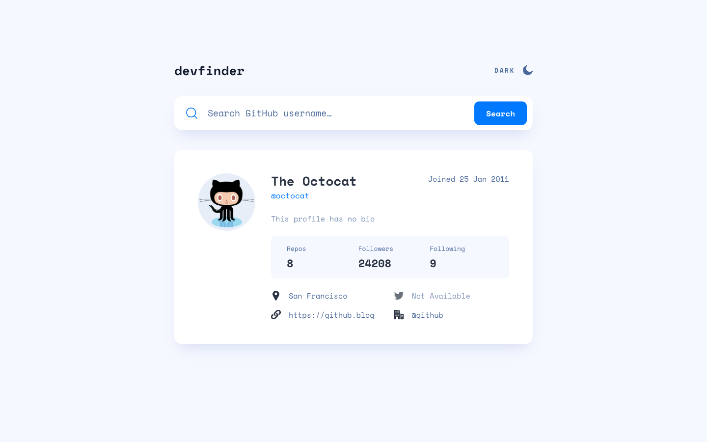
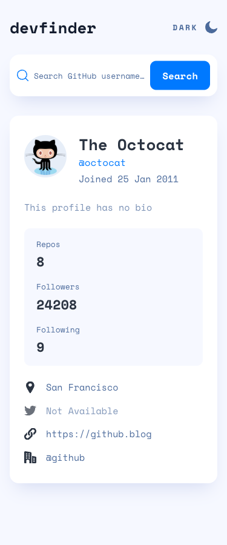

# Frontend Mentor - GitHub user search app solution

This is a solution to the [GitHub user search app challenge on Frontend Mentor](https://www.frontendmentor.io/challenges/github-user-search-app-Q09YOgaH6). It is a small React + TypeScript app that looks up any GitHub user through the public GitHub REST API and shows their profile card in light or dark mode. It was built with Spec-Driven Development (SDD) using GitHub's Spec Kit.


## Table of contents

- [Overview](#overview)
  - [The challenge](#the-challenge)
  - [Screenshot](#screenshot)
  - [Links](#links)
- [Getting started](#getting-started)
  - [Tests](#tests)
  - [Project structure](#project-structure)
- [My process](#my-process)
  - [Built with](#built-with)
  - [What I learned](#what-i-learned)
  - [Continued development](#continued-development)
  - [Useful resources](#useful-resources)
  - [AI Collaboration](#ai-collaboration)
- [Author](#author)
- [Acknowledgments](#acknowledgments)

## Overview

### The challenge

Users should be able to:

- [x] View the optimal layout for the app depending on their device's screen size
- [x] See hover states for all interactive elements on the page
- [x] Search for GitHub users by their username
- [x] See relevant user information based on their search
- [x] Switch between light and dark themes
- [x] **Bonus**: Have the correct color scheme chosen for them based on their computer preferences

Behavior from the spec:

- The profile for `octocat` loads on first visit.
- An unknown username shows a red "No results" label in the search bar and a "No results found!" card.
- Rate-limit and network problems show friendly messages. Raw errors are never shown.
- A missing name falls back to the username. An empty bio shows "This profile has no bio", and a missing location, website, Twitter, or company shows a dimmed "Not Available".
- Website, Twitter, and company are links. The company link drops the leading `@`, so `@github` links to `https://github.com/github`.

### Screenshot

<p>
  
  
</p>

### Links

- Solution URL: _coming soon (after the Frontend Mentor submission)_
- Live Site URL: [fsdev-github-user-search-app.vercel.app](https://fsdev-github-user-search-app.vercel.app)
- Repository: [gusanchefullstack/fsdev-github-user-search-app](https://github.com/gusanchefullstack/fsdev-github-user-search-app)

## Getting started

**Prerequisites:** Node.js 20.19+ or 22.12+ (developed on Node 26) and npm.

```bash
git clone https://github.com/gusanchefullstack/fsdev-github-user-search-app.git
cd fsdev-github-user-search-app
npm install
npm run dev        # http://localhost:5173
```

There are no environment variables. The app calls `https://api.github.com/users/<username>` without a token, and GitHub allows 60 of those requests per hour per IP.

| Script | What it does |
|--------|--------------|
| `npm run dev` | Start the Vite dev server |
| `npm run build` | Type-check and build to `dist/` |
| `npm run preview` | Serve the production build |
| `npm run lint` | Lint with oxlint |
| `npm test` | Run the Vitest suite once |

### Tests

The tests use [Vitest](https://vitest.dev/) with jsdom and [Testing Library](https://testing-library.com/). `fetch` is stubbed, so the tests never call GitHub.

```bash
npm test                               # all 34 tests
npx vitest run src/tests/App.test.tsx  # one file
npx vitest run -t "not-found"          # tests whose name matches
```

The suite covers:

- **Data mapping:** every placeholder rule, company `@` stripping, and website URLs without a scheme.
- **API responses:** 200 / 404 / 403 rate limit / 429 / 500, network failures, and unreadable responses.
- **Search flows:** the button and Enter key, trimming, and ignoring empty searches.
- **Error display:** the error states, and that a slow older search can't overwrite a newer one.
- **Theme:** the starting theme and the toggle.
- **Accessibility structure:** one `main`, one `h1`, and distinct link names.

### Project structure

```text
index.html               # Vite entry (loads Space Mono and /src/main.tsx)
public/                  # favicon
src/
├── App.tsx              # theme + search state, octocat on load
├── components/          # Header, ThemeToggle, SearchBar, ProfileCard, ProfileStats, ProfileLinks, MessageCard
├── lib/                 # githubApi.ts (fetch → result), toUserProfile.ts (display rules)
├── types/               # GitHub response, UserProfile, SearchResult, Theme
├── styles/              # variables.css (design tokens), global.css, *.module.css
├── assets/              # SVG icons
└── tests/               # Vitest suites and fixtures
my-sdd-docs/             # constitution + product spec I wrote
specs/001-github-user-search/  # Spec Kit spec, plan, research, data model, contracts, tasks
screenshots/             # README screenshots (375px and 1440px)
```

## My process

### Built with

- Semantic HTML5 markup (`header`, `main`, `form role="search"`, `article`, `dl`)
- CSS custom properties for every color, font, and spacing token, in one file (`src/styles/variables.css`)
- CSS Modules, Flexbox, and CSS Grid
- Mobile-first workflow (breakpoints at 768px and 1024px)
- [React 19](https://react.dev/) with function components
- [TypeScript](https://www.typescriptlang.org/)
- [Vite](https://vite.dev/) + [Vitest](https://vitest.dev/) + [Testing Library](https://testing-library.com/)
- [GitHub Spec Kit](https://github.com/github/spec-kit) for Spec-Driven Development
- Figma (read through the Figma Desktop MCP server) as the design source of truth

### What I learned

**Spec-Driven Development.** I started from a constitution (the rules the project must follow) and a product spec. Spec Kit turned those into a feature spec, a research log, a data model, contracts, and a list of 42 tasks. Checking the plan against the Figma file caught a mistake before any code existed: the first draft of the spec kept the old profile visible after a failed search, but the design replaces it with a "No results found!" card.

**Errors as values, not exceptions.** `fetchUser` never throws. It returns a union type, so TypeScript makes the UI handle every outcome, and a raw error message never reaches the screen:

```ts
export type SearchResult =
  | { status: 'ok'; profile: UserProfile }
  | { status: 'not-found' }
  | { status: 'rate-limited' }
  | { status: 'error' }
```

**Only the latest search counts.** Each new search aborts the previous request with an `AbortController`. That way, a slow older response can't replace a newer result.

**Theme-aware icons without an SVG plugin.** The provided SVGs are used as CSS masks, so each icon takes its color from the current theme and dims along with "Not Available":

```css
.icon {
  background-color: var(--color-icon);
  mask: url('../assets/icon-location.svg') center / contain no-repeat;
}
```

**Small bugs worth remembering:**

- `Intl.DateTimeFormat('en-GB', { month: 'short' })` prints **"Sept"**, but the design uses "Sep". The join date is built from UTC parts and a fixed month list, which also stops the day from changing with the viewer's time zone.
- A trailing space inside a visually hidden label (`<span>Company: </span>`) is dropped when the browser works out the link's accessible name. The result was "Company:@github". Moving the space outside the span fixed it.
- GitHub reports the rate limit as either `429` or `403` plus `x-ratelimit-remaining: 0`. Browsers can read that header because GitHub lists it in `Access-Control-Expose-Headers`.

### Continued development

- **Color contrast:** some design colors fall below WCAG AA contrast, for example white on `#0079ff` for the Search button (4.05:1) and the dimmed "Not Available" text. I kept the Figma colors on purpose, but I want to learn how to push back on design tokens earlier.
- **Theme flash:** on a dark-mode device the page is light for a moment before React applies the theme. A tiny inline script in `index.html` would fix that.

### Useful resources

- [GitHub REST API – Get a user](https://docs.github.com/en/rest/users/users#get-a-user): the response fields and their `null`/empty-string behavior.
- [GitHub REST API – Rate limits](https://docs.github.com/en/rest/using-the-rest-api/rate-limits-for-the-rest-api): why the app treats `403` and `429` as "rate limited".
- [MDN – `prefers-color-scheme`](https://developer.mozilla.org/en-US/docs/Web/CSS/@media/prefers-color-scheme): picking the starting theme from the device setting.
- [MDN – `mask-image`](https://developer.mozilla.org/en-US/docs/Web/CSS/mask-image): recoloring the provided SVG icons.
- [MDN – `AbortController`](https://developer.mozilla.org/en-US/docs/Web/API/AbortController): canceling outdated searches.
- [Testing Library – Queries by role](https://testing-library.com/docs/queries/byrole): tests that double as accessibility checks.
- [Spec Kit](https://github.com/github/spec-kit): the SDD workflow (`/speckit-specify` → `/speckit-plan` → `/speckit-tasks` → `/speckit-implement`).

### AI Collaboration

I used **Claude Code** (Claude Opus) as a pair programmer, driven by Spec Kit commands:

- **Specs and planning:** it restated my constitution for Spec Kit, wrote the feature spec from `my-sdd-docs/specs.md`, and produced the plan, research, data model, contracts, and task list. `/speckit-analyze` then found 1 high and 4 medium issues, which were fixed before implementation. The high one was a container with fixed widths that would have scrolled sideways on small phones.
- **Design:** it read spacing, colors, and states directly from the Figma file through the Figma Desktop MCP server. It also compared the running app against the frames at 375, 768, and 1440px in Chrome DevTools.
- **Implementation:** tests first for each user story, then code, with lint, type-check, build, and a Lighthouse audit at the end.

**What worked well:** because the spec is the source of truth, the AI had to stop and update the spec when the design disagreed with it, instead of quietly guessing. **What to watch for:** some tests passed on their first run because an earlier story had already built that behavior. That's worth noticing when you practice strict test-first development.

## Author

[](https://www.gustavosanchez.dev)
[](https://www.linkedin.com/in/gustavosanchezgalarza/)
[](https://github.com/gusanchefullstack)
[](https://hashnode.com/@gusanchedev)
[](https://x.com/gusanchedev)
[](https://bsky.app/profile/gusanchedev.bsky.social)
[](https://www.freecodecamp.org/gusanchedev)
[](https://www.frontendmentor.io/profile/gusanchefullstack)

**Gustavo Sanchez Galarza**

## Acknowledgments

- [Frontend Mentor](https://www.frontendmentor.io) for the challenge, the Figma design, and the icons.
- [GitHub](https://docs.github.com/en/rest) for the public users API and [Spec Kit](https://github.com/github/spec-kit).
- The [Space Mono](https://fonts.google.com/specimen/Space+Mono) typeface by Colophon Foundry, via Google Fonts.
